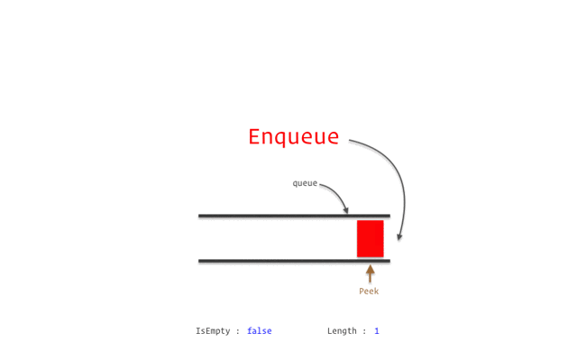
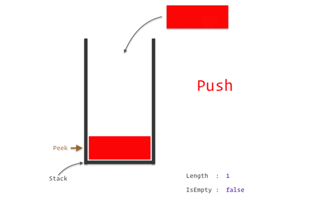
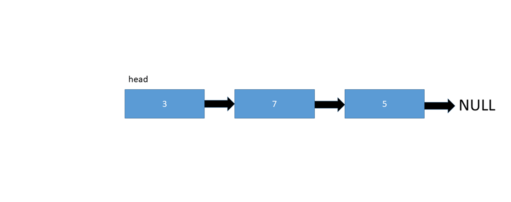
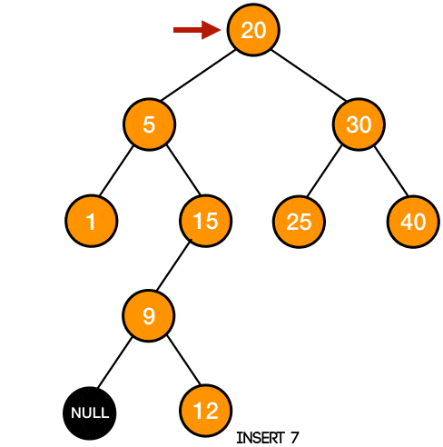
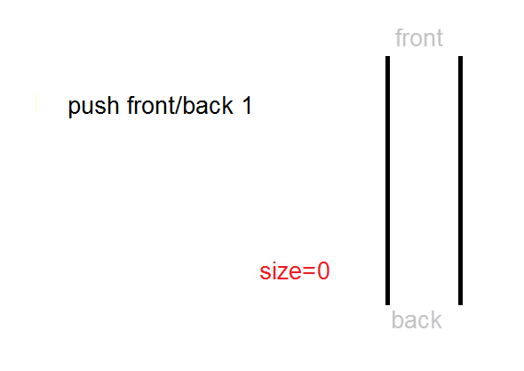

# Estrutura de Dados em

## Objetivo

O objetivo desse repositório é compartilhar meus estudos desenvolvidos em Estrutura de dados e organizados em pacotes dentro de um projeto na IDE [Eclipse](https://www.eclipse.org/downloads/). Caso queira importar, é só clonar o repositório dentro de uma pasta chamada "Estrutura de Dados" e importá-lo no Eclipse.

## Classes Importantes

### Fila (Queue)

| **Pacote** | **Classe** | **Propósito** |
| ---------- | ---------- | ------------- |
| fila_livro | Fila.java | Implementação do algoritmo de fila |
| fila_livro | Principal.java | Exemplificação da utilização de uma fila conforme a classe Fila.java |
| fila_livro | Principal2.java | Exemplificação da utilização de uma fila conforme a classe Queue, nativa da linguagem Java |
| aula_10 | Exemplo2.java | Exercitando operações básicas |
| aula_10 | Exemplo3.java | Duas filas para uma fila com elementos alternados |
| aula_10 | Exemplo4.java | Inversão de uma fila |
| aula_10 | Exemplo5.java | Remoção de elementos repetidos em uma fila |
| aula_10 | Exemplo6.java | Filtrando uma lista (Começo com vogal) |
| aula_10 | Exemplo7.java | Se tiver repetido, retorna true |
| aula_10 | Exemplo8.java | Retorna as palavras que aparecem um número impar de vezes |
| lista_de_exercicio_2 | Fila1.java | Uma fila construida a partir de duas pilhas |
| lista_de_exercicio_2 | Fila2.java | Filas em ordem diferente, porém com os mesmos elementos |

### Pilha (Stack)

| **Pacote** | **Classe** | **Propósito** |
| ---------- | ---------- | ------------- |
| pilha_livro | Pilha.java | Implementação do algoritmo de pilha |
| pilha_livro | Principal.java | Exemplificação da utilização de uma fila conforme a classe Pilha.java |
| pilha_livro | Exemplo.java | Exemplificação da utilização de uma fila conforme a classe Stack, nativa da linguagem Java |
| pilha_livro | Exemplo2.java | Segunda exemplificação da utilização de uma fila conforme a classe Stack, nativa da linguagem Java |
| aula_11 | Exercicio1.java | Operações básicas |
| aula_11 | Exercicio2.java | Operações básicas pt.2 |
| aula_11 | Exercicio3.java | Operações básicas pt.3 |
| aula_11 | Exercicio4.java | Notação Polonesa Inversa |
| aula_11 | Exercicio5.java | Sequência de parenteses // Expressão balanceada |
| aula_11 | Exercicio6.java | Maior retângulo em um histograma |
| aula_11 | Exercicio7.java | Ordenar pilha em ordem crescente |
| aula_11 | Exercicio8.java | Pilhas em ordem diferente, porém com os mesmos elementos |
| lista_de_exercicio_2 | Pilha1.java | Menor elemento |
| lista_de_exercicio_2 | Pilha2.java | Expressão balanceada |

### Lista (List)

| **Pacote** | **Classe** | **Propósito** |
| ---------- | ---------- | ------------- |
| aula_13 | NoS.java | Implementação de um Nó em uma Lista Simplesmente Encadeada |
| aula_13 | ListaSimplesmenteEncadeada.java | Implementação de uma Lista Simplesmente Encadeada |
| aula_13 | TestaListaEncadeada.java | Testando a implementação da Lista Simplesmente Encadeada |
| aula_13 | NoD.java | Implementação de um Nó em uma Lista Duplamente Encadeada |
| aula_13 | ListaDuplamenteEncadeada.java | Implementação de uma Lista Duplamente Encadeada |
| aula_13 | TestaListaDuplaEncadeada.java | Testando a implementação da Lista Duplamente Encadeada |
| aula_13 | NoC.java | Implementação de um Nó em uma Lista Circular |
| aula_13 | ListaCircular.java | Implementação de uma Lista Circular |
| aula_13 | TestaListaCircular.java | Testando a implementação da Lista Circular |
| aula_13 | Lista1.java | Implementação de uma Lista Encadeada em uma classe só e impressão reversa |
| aula_13 | Lista2.java | Implementação de uma Lista Encadeada em uma classe só e checagem para ver se está ordenada |
| aula_13 | Lista1.java | Implementação de uma Lista Encadeada em uma classe só e impressão reversa |
| aula_13 | Lista2.java | Implementação de uma Lista Encadeada em uma classe só e checagem para ver se está ordenada |
| lista_de_exercicio_2 | Lista1.java | Implementação de uma Lista Encadeada em uma classe só e impressão reversa |
| lista_de_exercicio_2 | Lista2.java | Implementação de uma Lista Encadeada em uma classe só e checagem para ver se está ordenada |

### Árvore (Tree)

| **Pacote** | **Classe** | **Propósito** |
| ---------- | ---------- | ------------- |
| lista_de_exercicio_2 | Arvore1.java | Contando o número de folhas (Arvoré Binária) |
| lista_de_exercicio_2 | Arvore2.java | Verificar se duas árvores são iguais (Arvoré Binária) |
| lista_de_exercicio_2 | Desafio2.java | Implementação de árvore AVL |

### Filas Duplas (Deques)

| **Pacote** | **Classe** | **Propósito** |
| ---------- | ---------- | ------------- |
| lista_de_exercicio_2 | Desafio1.java | Implementação de Deque |

